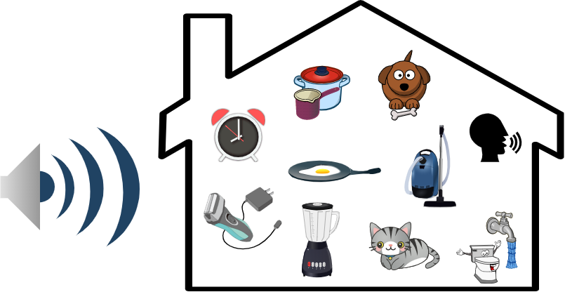

<p align="center">
	<a href="https://project.inria.fr/desed/" rel="desed website"></a>
</p>

# Desed dataset
Domestic environment sound event detection (DESED) dataset utilities. 
Mix of recorded and synthetic data (used in DCASE task 4 since 2019).

[](https://opensource.org/licenses/MIT)


*If you use this dataset, do not hesitate to update [the list](#list-of-papers-and-code-using-desed) 
of papers below with your paper by doing a pull request. 
If you use and like this work, you can [cite it](#citing-us) :blush:*

## Links
* Website: [https://project.inria.fr/desed/][website]
* Zenodo datasets: [DESED_synthetic][desed-synthetic], [DESED_public_eval][desed-public-eval]
* Papers:
    * [Turpault et al.][paper-description] Description of DESED dataset + official results of DCASE 2019 task 4.
    * [Serizel et al.][paper-eval] Robustness of DCASE 2019 systems on synthetic evaluation set.


**Table of contents**
  - [Installation](#installation)
  - [Usage](#usage)
  - [Short description](#short-description-of-desed-dataset)
  - [Long description](#long-description)
  - [List of papers/code using DESED](#list-of-papers-and-code-using-desed)
  - [FAQ](#faq)
  - [Important updates](#important-updates)
  - [Citing us](#citing-us)
  - [References](#references)
      
## Installation
#### Recommended install
Take into account your changes of the code in the `desed/` folder.
- `git clone https://github.com/turpaultn/DESED`
- `cd DESED`
- `pip install -e .`

*In this case, all your changes in `desed` folder will be taken into account*

#### Use desed in other projects
Copying code from `synthetic/code/` or `real/code/` folders without changing `desed/` content
- `pip install desed`

## Usage
### Download

```python
import desed
desed.download_real("./data/dataset")
desed.download_desed_soundbank("./data/soundbank")
# Additional sets:
desed.download_fuss("./data/FUSS")
desed.download_fsd50k("./data/fsd50k", gtruth_only=True) # groundtruth only to use annotations for FUSS
```
### Generate soundscapes
* See [examples](./examples)

## Short description of DESED dataset
There are 3 different datasets:
* Recorded soundscapes (a.k.a. real).
* Soundbank to generate synthetic soundscapes.
* Public evaluation (recorded soundscapes) (a.k.a., Youtube in DCASE19, Vimeo is not available): [DESED public eval][desed-public-eval]

DESED dataset is for now composed of 10 event classes in domestic environment.
<p align="center">

</p>

### You can
* Use only the real dataset.
* Use the soundbank to create your own synthetic soundscapes. (generate new mixtures using [Scaper][scaper] [[1]](#1))
* Reproduce the soundscapes made for DCASE task 4.


## Long Description
There are 3 different datasets: 
* Recorded soundscapes (a.k.a., real). 
* Synthetic soundbank + DCASE task 4 soundscapes: [DESED_synthetic][desed-synthetic]
* Public evaluation (recorded soundscapes) (a.k.a., Youtube in DCASE19, Vimeo is not available): [DESED public eval][desed-public-eval]

*All these datasets contain an "audio" folder associated with a "metadata" folder 
so they can all be grouped together by merging them*

DESED dataset is for now composed of 10 event classes in domestic environment.
The soundbank can include annotated data outside of the 10 classes to allow the creation of more realistic soundscapes.

**Overview**:
* Recorded soundscapes:
	* Verified and unverfied subset of [Audioset][audioset].
		* Unlabel_in_domain data: Unverified data have their label discarded: *14412 files*.
		* Weakly labeled data: training data have their labels verified at the clip level: *1578 files*.
		* Validation data have their labels with time boundaries (strong labels): *1168 files*.
		* Evaluation public files: Youtube files *692 files*
* Soundbank:
	* Background files are extracted from SINS [[2]](#2), TUT[[7]](#7), MUSAN [[3]](#3) or Youtube and have been selected because they 
	contain a very low amount of our sound event classes.
	* Foreground files are extracted from Freesound [[4]](#4)[[5]](#5) and manually verified to check the quality 
	and segmented to remove silences.
	* Mixtures are described in [Generating new synthetic soundscapes](#gendata) below.
	* Soundbank:
		* Training: *2060 background files* (SINS) and *1009 foreground files* (Freesound).
		* Eval: *12* (Freesound) + *5* (Youtube) *background files* and *314 foreground files* (Freesound). 

* DCASE 2019
	* It uses synthetic soundbank, recorded soundscapes, and public evaluation data (a.k.a., Youtube eval during DCASE19).
	* If you want more information about DCASE19 dataset visit [DCASE 2019 task 4 web page][website-dcase19-t4]
	* If you only want to download DCASE19 files, go to [dcase2019 task 4](#dcase2019-task-4).
	

### Example of DESED dataset in 2019
![dcase19-diagram][img-desed2019]

### Soundbank
![soundbank-diagram][img-soundbank]

## FAQ
* Why don't we have a single dataset repository ?

The synthetic sounbank or recorded soundscapes can be used independently for different purposes. 
For example, one can create new synthetic soundscapes and evaluate his system on synthetic data only to focus on a specific problem.

* Why audio is not always included in the repository ?

Because of licenses issues. (Example of SINS in the training soundbank)
We do not have the problem for evaluation data because we try to overcome the problem after running into this issue.

* I have a problem downloading the recorded soundscapes. How do I do ?

If you're in a country with youtube restrictions, you can try to use a VPN and the --proxy option from youtube-dl.
You can also try to upgrade youtube-dl since it is regularly updated. 
Finally, if you succeeded to download most of the files, you can send the missing files as stated in the `real/README.md.

* How do I evaluate and compare my system with other methods using this dataset ?

In [this paper][paper-description] you can refer to the column 'Youtube' and for further study, you can
cite the DESED public evaluation set. 


## List of papers and code using DESED
Feel free to add your paper in the file [list_papers_using_desed.md][list_papers_md] if you use the dataset and have a result on the public evaluation set:

<!-- include list_papers_using_desed.md -->
Paper                                                                       | Code
--------------------------------------------------------------------------- | ---------------------------
[Turpault et al.](https://hal.inria.fr/hal-02160855), DCASE workshop 2019.  | https://github.com/turpaultn/DCASE2019_task4
[Serizel et al.](https://hal.inria.fr/hal-02355573), ICASSP 2020            | https://github.com/turpaultn/DESED
[Turpault et al.](https://hal.inria.fr/hal-02467401), ICASSP 2020           | https://github.com/turpaultn/walle
[Turpault et al.](https://hal.inria.fr/hal-02891665), preprint              | https://github.com/turpaultn/dcase20_task4/tree/papers_code
[Turpault et al.](https://hal.inria.fr/hal-02891700), preprint              | https://github.com/turpaultn/dcase20_task4/tree/papers_code


<!-- end -->

*Note: to add it to README.md before doing the pull request, run `python generate_table.py`*

## Important updates
- 26th February 2020, v1.2.5, refactor, get rid of bash files and ease the download through the package.
- 7th December 2020, v1.2.2, ease the download of soundbank (with or without pre-split validation)
- 23th April 2020, v1.2.0, update the generation procedure (`add_fg_event_non_noff`) to use all parts of files longer than 
the duration of the soundscapes created + Add possibility to use only background from certain labels (i.e: sins or tut).
- 18th March 2020, v.1.1.7, update DESED_synth_dcase20_train_jams.tar of DESED_synth. They use pitch shifting, 
while the others didn't. These are the final JAMS used for dcase2020 baseline. Also commenting reverb since not used 
for the baseline.


## Licenses
The python code is publicly available under the MIT license, see the LICENSE file. 
The matlab code is taken from the Audio degradation toolbox [[6]](#6), see the LICENSE file.

The different datasets contain a license file at their root for the attribution of each file.

The different platform used are: Freesound [[4]](#4)[[5]](#5), Youtube, MUSAN [[3]](#3) and SINS [[2]](#2).  

##  Citing us
Using this repository and happy to give attribution ? Here is how to cite us:

- N. Turpault, R. Serizel, A. Parag Shah, J. Salamon. 
Sound event detection indomestic environments with weakly labeled data and soundscape synthesis. 
Workshop on Detectionand Classification of Acoustic Scenes and Events, Oct 2019, New York City, USA.

- R. Serizel, N. Turpault, A. Shah, J. Salamon. 
Sound event detection in synthetic domestic environments. 
ICASSP, May 2020, Barcelona, Spain.

## References
<a id="1">[1]</a> J. Salamon, D. MacConnell, M. Cartwright, P. Li, and J. P. Bello. Scaper: A library for soundscape synthesis and augmentation
In IEEE Workshop on Applications of Signal Processing to Audio and Acoustics (WASPAA), New Paltz, NY, USA, Oct. 2017.

<a id="2">[2]</a> Gert Dekkers, Steven Lauwereins, Bart Thoen, Mulu Weldegebreal Adhana, Henk Brouckxon, Toon van Waterschoot, Bart Vanrumste, Marian Verhelst, and Peter Karsmakers.
The SINS database for detection of daily activities in a home environment using an acoustic sensor network.
In Proceedings of the Detection and Classification of Acoustic Scenes and Events 2017 Workshop (DCASE2017), 32–36. November 2017.

<a id="3">[3]</a> David Snyder and Guoguo Chen and Daniel Povey.
MUSAN: A Music, Speech, and Noise Corpus.
arXiv, 1510.08484, 2015.

<a id="4">[4]</a> F. Font, G. Roma & X. Serra. Freesound technical demo. In Proceedings of the 21st ACM international conference on Multimedia. ACM, 2013.

<a id="5">[5]</a> E. Fonseca, J. Pons, X. Favory, F. Font, D. Bogdanov, A. Ferraro, S. Oramas, A. Porter & X. Serra. 
Freesound Datasets: A Platform for the Creation of Open Audio Datasets.
In Proceedings of the 18th International Society for Music Information Retrieval Conference, Suzhou, China, 2017.

 <a id="6">[6]</a> M. Mauch and S. Ewert, “The Audio Degradation Toolbox and its Application to Robustness Evaluation”. 
In Proceedings of the 14th International Society for Music Information Retrieval Conference (ISMIR 2013), Curitiba, Brazil, 2013.

<a id="7">[7]</a> A. Mesaros and T. Heittola, T. Virtanen, “TUT database for acoustic scene classification and sound event detection”.
In Proceedings of the 24th European Signal Processing Conference (EUSIPCO), Budapest, Hungary, 2016.


[audioset]: https://research.google.com/audioset/index.html
[desed-logo]: ./img/Desed.png
[desed-synthetic]: https://zenodo.org/record/3702397
[desed-public-eval]: https://zenodo.org/record/3588172
[fuss_zenodo]: https://zenodo.org/record/3694384/
[img-desed2019]: ./img/desed_block_diagram.png
[img-soundbank]: ./img/soundbank_diagram.png
[list_papers_md]: ./list_papers_using_desed.md
[paper-description]: https://hal.inria.fr/hal-02160855
[paper-eval]: https://hal.inria.fr/hal-02355573
[paper-turpault-icassp20]: https://hal.inria.fr/hal-02467401
[real_folder]: ./real
[scaper]: https://github.com/justinsalamon/scaper
[synthetic_folder]: ./synthetic
[website]: https://project.inria.fr/desed/
[website-dcase19-t4]: http://dcase.community/challenge2019/task-sound-event-detection-in-domestic-environments
[website-dcase20-t4]: http://dcase.community/challenge2020/task-sound-event-detection-and-separation-in-domestic-environments
